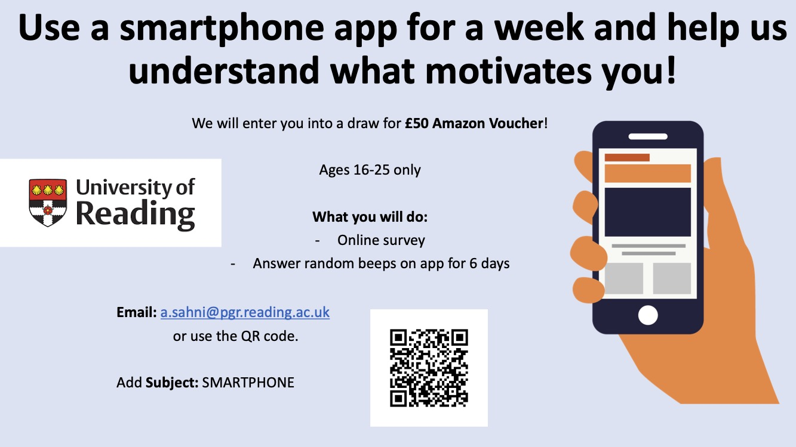
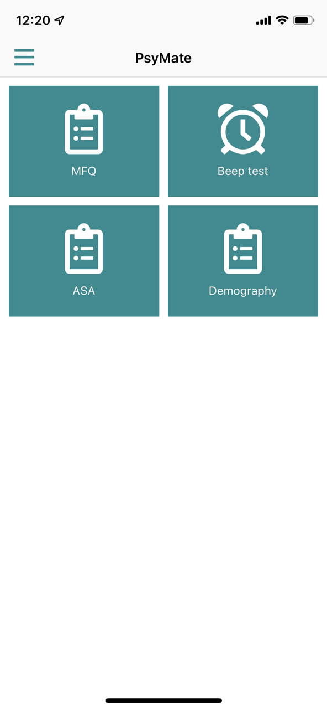

<body style="background-color:e4e4e4;"></body>

  

This page contains information about the SMARTPHONE study being conducted by the NRG lab, University of Reading.  

### This is a study being conducted by the [NRG-Lab](https://www.nrg-lab.co.uk/) by the following researchers:
Prof. Ciara McCabe (<a href="mailto:c.mccabe@reading.ac.uk">c.mccabe@reading.ac.uk</a>) 

Angad Sahni, PhD Student (<a href="mailto:a.sahni@pgr.reading.ac.uk">a.sahni@pgr.reading.ac.uk</a>) 

Tarun Vermani, MSc Student (<a href="mailto:t.vermani@student.reading.ac.uk">t.vermani@student.reading.ac.uk</a>)
 

### You can view the instructions in [<u>video</u>](README.md#instruction-video) or [<u>written</u>](README.md#written-instructions) form.  Both contain the same information.

 

# Take Part!
 
 

  
 

 

 

# Instruction Video

<iframe width="836" height="470" src="https://www.youtube.com/embed/AivE2o9IXr4" title="University of Reading || PsyMate2 || SMARTPHONE Study Instructions" frameborder="10" allow="accelerometer; autoplay; clipboard-write; encrypted-media; gyroscope; picture-in-picture" allowfullscreen></iframe>
 

<h3 style="color:red">IMPORTANT</h3>

1.	Fill in the beep questionnaire **immediately or as soon as possible**.
2.	If you fail to complete a test, it’s okay. Please ensure you **complete as many as possible**. 
3.	Be sure to <b><u>log out</u></b> after the debrief form has been filled, or else **your data will not be sent**.  You need an active internet connection to be able to upload your data.

 
 
 

# Written Instructions

**Step 1**  
Download the <b>PsyMate2</b> application from one of the links below, based on which mobile type you are using:  
The **iPhone** link can be found here: [https://apps.apple.com/gb/app/psymate-2/id1185231488](https://apps.apple.com/gb/app/psymate-2/id1185231488)  
The **Android** link can be found here: [https://play.google.com/store/apps/details?id=eu.smarthealth.umesm](https://play.google.com/store/apps/details?id=eu.smarthealth.umesm)  
Both links are available on the PsyMate website: [https://www.psymate.eu](https://www.psymate.eu)  
Or you can open the AppStore yourself and download the application by searching for <b>PsyMate2</b> and looking for the logo:
 
 

  

 
 

**Step 2**  
Scan your **unique QR code** you will have received by email. If the login details don’t work, please email either <a href="mailto:a.sahni@pgr.reading.ac.uk">Angad Sahni</a> or <a href="mailto:t.vermani@student.reading.ac.uk">Tarun Vermani</a>. 

 
 

**Step 3** 
After completing the login process, please make sure you **complete all items** 
before leaving this page or your data may not be usable. 
The page should look like this:  
 
 

  

 
 

**Step 4**  
Go to the menu by clicking the **3 horizontal bars** in the top left of the screen, then select Settings.  
Then go to sound settings and choose your <b>notification sound</b>. You should use the ‘Alarm’ option.
  
Please also go into the settings of your phone and ensure that <b>PsyMate notifications are enabled</b> on the device and ensure it is not on do not disturb.

 
 

**Step 5**  
Close or minimise the PsyMate App – you should start receiving notifications within a few hours.  
If you do not receive one by the end of the day, please contact a member of the research team.  
**Only the Beep questionnaire will be repeated**.

 
 

**Step 6** 
After the final ‘beep’ prompt on <b>day 7</b>, you will receive a **debrief form** to complete.  
Please complete this and then <b><u>log out</u></b> of the PsyMate app.

 
 

<h3 style="color:red">IMPORTANT</h3>

1.	Fill in the beep questionnaire **immediately or as soon as possible**.
2.	If you fail to complete a test, it’s okay. Please ensure you **complete as many as possible**. 
3.	Be sure to <b><u>log out</u></b> after the debrief form has been filled, or else **your data will not be sent**.  You need an active internet connection to be able to upload your data.

 
 
 
 

<button onclick="topFunction()" id="myBtn" title="Go to top">Top</button>

